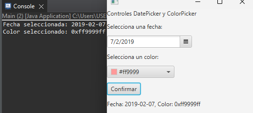
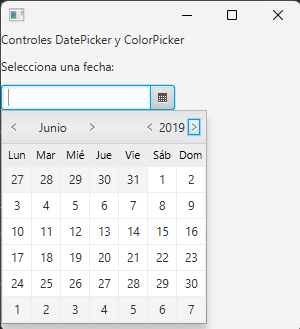
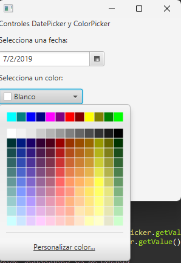

## Proyecto Interfaz Controles DatePicker y ColorPicker
Se desarrollo una interfaz gráfica de usuario (GUI) en JavaFX que permite a los usuarios seleccionar una fecha y un color, y visualizar estas selecciones en la interfaz.
## Image de Controles
.
## DatePicker
Un control de selección de fecha que permita a los usuarios seleccionar una fecha específica desde un calendario desplegable.

.
## ColorPicker
Un control de selección de color que permita a los usuarios elegir un color específico desde una paleta de colores.
.

## Button 
Un botón para confirmar la selección de la fecha y el color.

      Button confirmarButton = new Button("Confirmar");
## Label
 Etiquetas para guiar al usuario sobre qué hacer (por ejemplo, “Selecciona una fecha:” y “Selecciona un color:”).

       Label fechaLabel = new Label("Selecciona una fecha:");
       Label colorLabel = new Label("Selecciona un color:");
       Label titulo =      new Label("Controles DatePicker y ColorPicker");
 
 ## VBox Layout
 Utilizar un layout vertical (VBox) para organizar los controles de manera ordenada y clara.

        VBox contenedor = new VBox();
	contenedor.setSpacing(10);
	contenedor.getChildren().addAll(titulo,fechaLabel, fechaPicker, colorLabel, colorPicker, confirmarButton);
